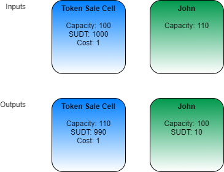

# Simple Token Sale Lock Script

> This project is still under active development and should not be used in production environments.

A simple Lock Script for handling the sale of [SUDT](https://talk.nervos.org/t/rfc-simple-udt-draft-spec/4333) tokens for CKBytes on Nervos CKB.

The Lock Script can be added to any SUDT Cell to enable any user to buy SUDT tokens for a predefined price in CKBytes.

## Example Transaction

Below is an example of a basic purchase transaction. John purchases 10 SUDT tokens from the Token Sale Cell at a cost of 1 CKByte per SUDT token.

Note: The capacity and cost amounts are normally specified in Shannons, but have been simplified to CKBytes for readability.



## Usage

### Args Definition
- The Owner's Lock Script Hash (32 bytes)
- The Cost per token in CKByte Shannons. (u64 LE 8 bytes)
- A unique identifier for the Token Sale Cell. (u32 LE 4 bytes)

The total size of the args should be a minimum of 44 bytes, or 40 bytes if no identifier is specified.

Note: The unique identifier is optional, but highly recommended because it allows for multiple Token Sale Cells to exist in the same transaction and provides an easy way for third party analytics to track an individual Cell. Using a u32 is the recommended guideline, but any form of unique identifier will work and can safely exceed 4 bytes.

> Warning: Failure to supply proper arguments to the Lock Script can result in the permanent loss of SUDT tokens.

### Owner Mode

Administrative control of the Token Sale Lock is enabled using the Owner Input Recognition design pattern. If any input Cell in a transaction has a Lock Script Hash that matches the first 32 bytes of the args provided to the Token Sale Lock, then owner mode is enabled.

Owner mode allows the following actions:
- Add or remove CKBytes from the Cell.
- Add or remove SUDT tokens from the Cell.
- Update the token cost argument.
- Update the unique identifier argument.
- Removal of the Token Sale Lock in favor of a different lock.

## Building

This project is built in Rust using the [Capsule](https://github.com/nervosnetwork/capsule) development framework.

### Supported Environments
- Linux
- MacOS
- Windows (WSL2)

### Prerequisites
- [Capsule](https://github.com/nervosnetwork/capsule)

### Building a debug binary:

``` sh
capsule build
```

### Running tests on the debug binary:

``` sh
capsule test
```

### Building a release binary:

``` sh
capsule build --release
```

### Running tests on the release binary:

``` sh
capsule test --release
```

## Constraints
The constraints of the Token Sale Lock Script work with the constraints of SUDT and of Nervos CKB.

- The SUDT Type Script enforces the conservation of tokens, which forbids a user from minting tokens for free.
- The Nervos CKB protocol enforces the conservation of CKBytes, which forbids a user from minting CKBytes for free.
- The Token Sale Lock Script enforces the exchange of CKBytes for SUDT tokens.

The Token Sale Lock Script uses the following constraints to ensure proper operation.

1. The arguments must be equal or greater than 40 bytes in length. The arguments length will be 44 bytes or more with a unique identifier, but the Script does not check this.
2. If an input Cell's lock hash matches that specified in the args, owner mode is then enabled and the Cell unlocks unconditionally.
3. The transaction must have exactly one input Cell with the Token Sale Lock Script and exactly one output Cell with the Token Sale Lock Script. These Cells must have a matching unique identifier.
4. The Type Script of both the input Token Sale Cell and output Token Sale Cell must match.
5. The cost of SUDTs in Shannons must be greater than or equal to 1.
6. The capacity on the output Token Sale Cell must be higher than on the input Token Sale Cell.
7. The SUDT amount of the output Token Sale Cell must be lower than the input Token Sale Cell.
8. The capacity difference between the input/output Token Sale Cells divided by the cost must equal the SUDT amount difference between the input/output Token Sale Cells.

## License
[MIT](LICENSE)